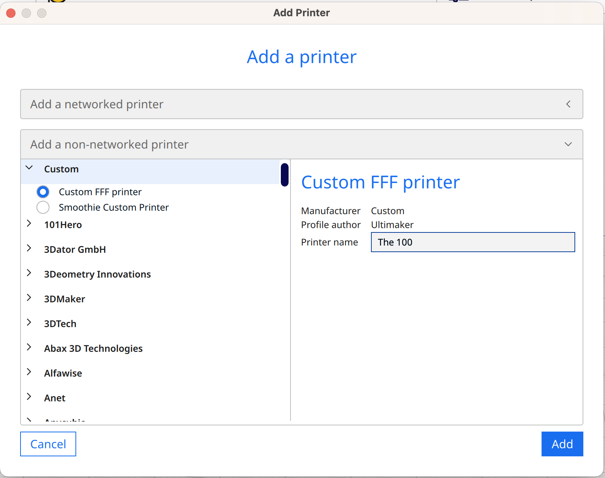
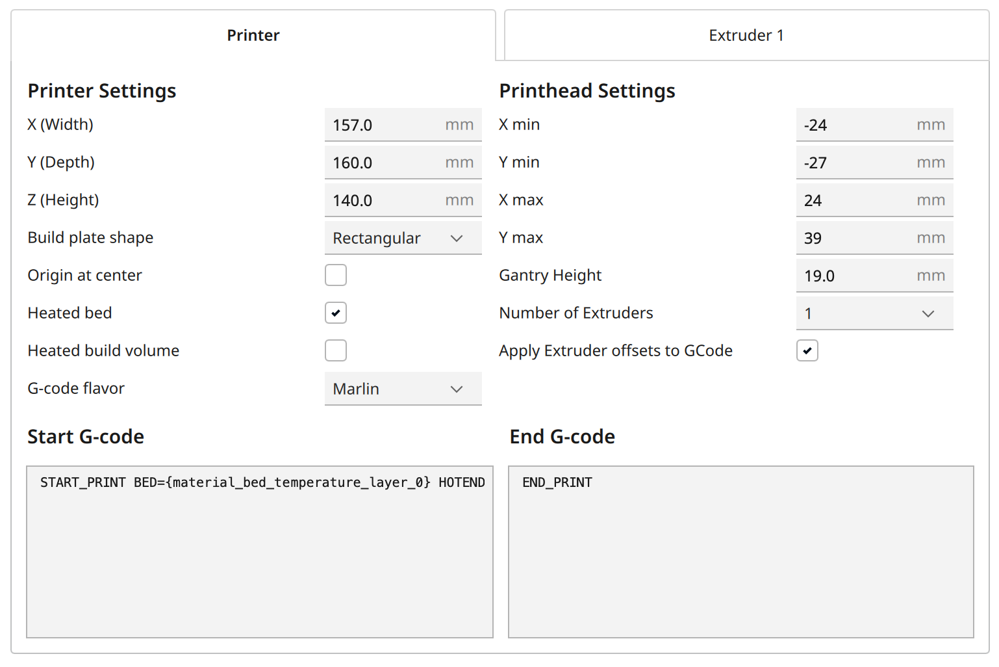
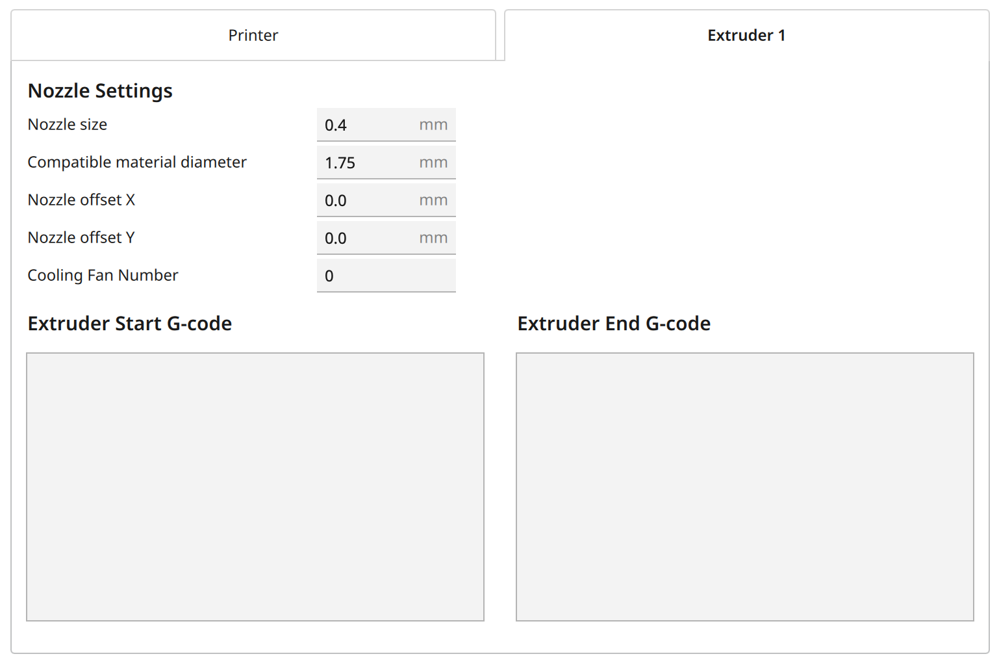

1. Add a new Printer in Cura:

2. With following Printer Settings:

3. and following Extruder Settings:

4. Import profiles at **Preferences->Configure Cura->Profiles** by pressing the Import button
5. Install the Moonraker plugin to communicate with the printer through WIFI. You have to add the Ip Address of the printer in the Moonraker Settings.
